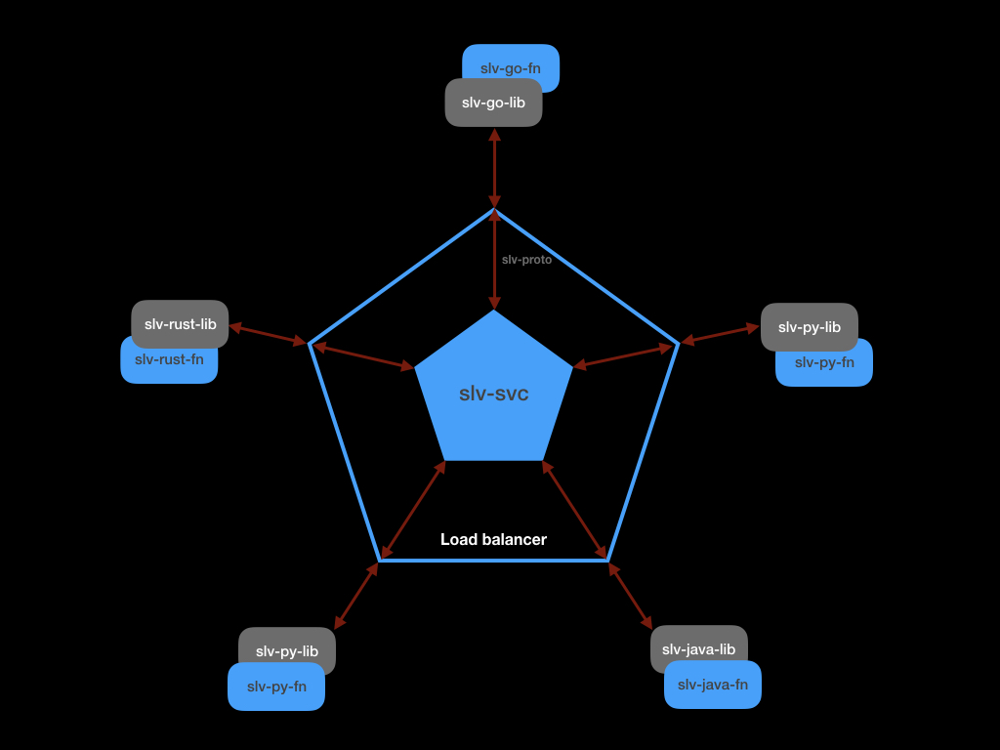
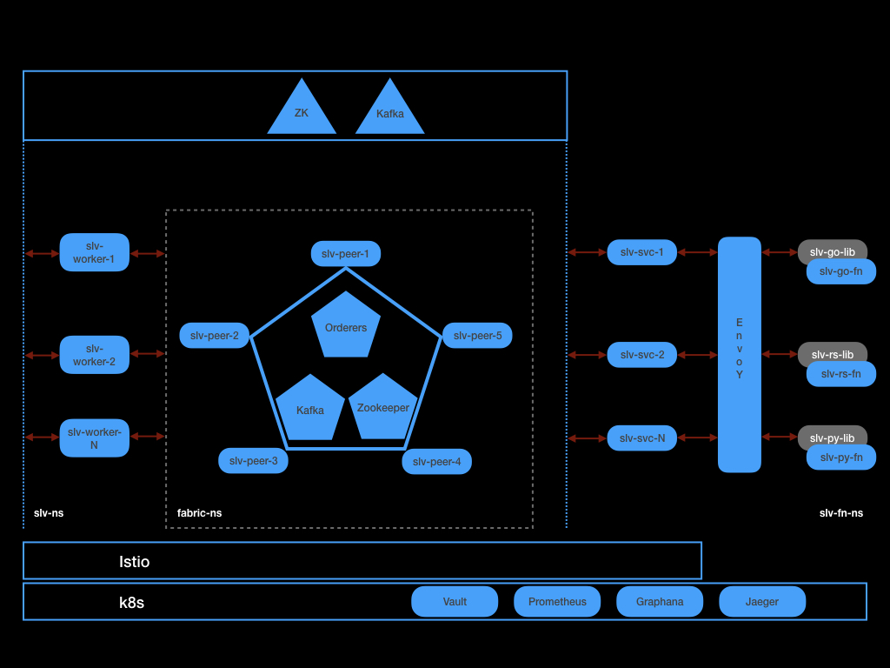

# slv-go-lib

### Goals
- Provide an easy to use, performant, vendor neutral library to invoke SLV service.
- Serve IoT & Edge scenarios

### Overview

This repository contains the golang library that can be used by a serverless function to manage state in a Serverless Ledger Variable Service. The functions using this library can be deployed on OpenFaas, dapr environments.

### Overview of Serverless Ledger Variables (SLV)

SLV provides a way for serverless functions to create and manage state. In addition to usual properties such Type, Scope, Permissions; SLV provides -

- All writes to the state are performed when the Blockchain consensus is achieved.
- History of all changes to the state can be queried.

